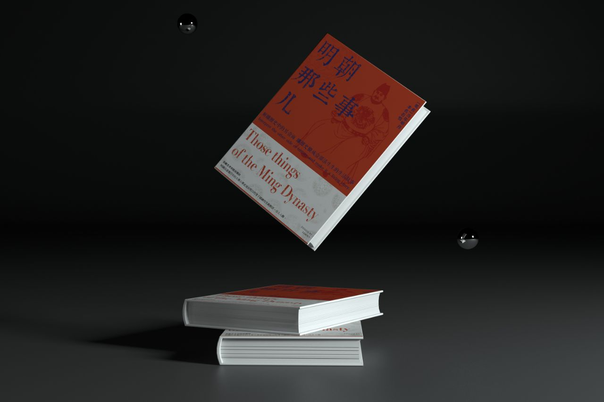

- 
-
- #+BEGIN_QUOTE
  能改的，叫做缺点；不能改的，叫做弱点。
  
  你还很年轻，将来你会遇到很多人，经历很多事，得到很多，也会失去很多，但无论如何，有两样东西，你绝不能丢弃，一个叫良心，一个叫理想。
  
  纯粹和执着，也是有区别的。所谓执着，就是不见棺材不掉泪，而纯粹，是见了棺材，也不掉泪。
  #+END_QUOTE
- 盲目的自信往往比自卑更可怕。权力在给人尊严的同时，也会带给他们自私。
- 很多时候，愤怒者往往是弱者。
- 可是在权力的擂台上，不折不扣的好人注定是要完蛋的。
- 历经磨难，矢志不移，叫作信念。不畏强权，虽死无惧，叫作勇气。
- 以史为鉴是不可能的。其实历史没有变化，技术变了，衣服变了，饮食变了，这都是外壳，里面什么都没有变，还是几千年前那一套，转来转去，该犯的错误还是会犯，该杀的人还是会杀，岳飞会死，袁崇焕会死，再过一千年，还是会死。