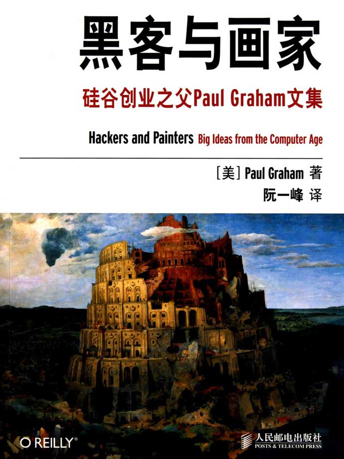

- 
-
- #+BEGIN_QUOTE
  你不能盼望先有一个完美的规格设计，然后再动手编程，这样想是不现实的。
  
  黑客可以通过观看优秀的程序学会编程，不是看它们的执行结果，而是看它们的源代码。
  
  程序写出来是给人看的，附带能在机器上运行。
  #+END_QUOTE
- 与笨蛋争论，你也会变成笨蛋
- 自由思考比畅所欲言更重要
- 一下子从无到有做出一个大项目是很恐怖的一件事。
- 有一些简单重复某些信息就能解决的问题不要想得太复杂。
- 评价一种语言的优劣不是简单地看最后的程序是否表达得很漂亮，而要看程序从无到有的那条完成路径是否很漂亮。
- 任何时候代码都必须能够运行。
-